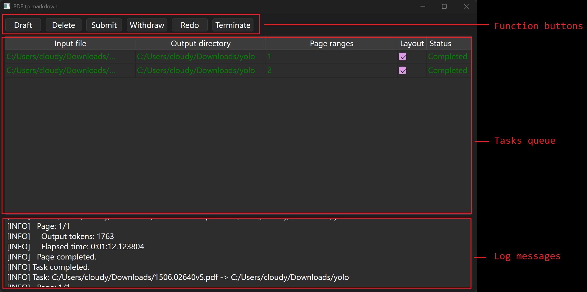

# PDF to markdown

 Convert PDF or image to markdown


This is an offline version of Chandra OCR 2, suitable for Windows personal computer. It only downloads the model once from huggingface.co when installing (about 13GB), then it's fully offline without any need of credits or Internet connection.

The major customization for Windows is `trition` package. Linux is even more native for this program, which means this program is easily to migrate to Linux operation systems.


## Acknowledgement

https://github.com/datalab-to/chandra

https://huggingface.co/datalab-to/chandra-ocr-2

https://qwen.ai/blog?id=qwen3.5

https://github.com/invl/pip-autoremove

## Install

Create and activate a Python virtual environment.

Run the following command in terminal.

```
pip install -r requirements.txt --extra-index-url https://download.pytorch.org/whl/cu130
python install.py
```

## Usage

Activate Python virtual environment.

Run the following command in terminal.

```
python main.pyw
```

Wait the program to load OCR model in terminal, then a new window will show in taskbar. 

Open the window:



### Quick start

To create the first task, click "draft", and the table will show the first row. 

1.   Double click "input file" cell, a file selector will pop up. Select a PDF or image file.
2.   Double click "output directory" cell, a folder selector will pop up. Select a folder to save OCR results. A markdown file and a subfolder `assets/` containing images will be saved to this directory.
3.   If the input file is PDF format, page ranges is enabled. Fill in page ranges. The format of page range is the same as Microsoft Office, most printer settings, and most PDF viewers. If the input file is image, this field is disabled.

Click "submit" to submit the task. OCR model will starts recognizing layout and text of the input file. When the task is completed, results are saved in output directory.

### Features

In tasks queue, each row is a task. It has the following status: (Empty), Queued, Processing, Completed, Failed.

| Status     | Description                                                  |
| ---------- | ------------------------------------------------------------ |
| Draft      | The user can edit the config by clicking the cells. "Input file" must be filled before "page ranges". "Page ranges" is only enabled when "input file" is PDF. |
| Queued     | The task is ready to be processed. The config is not allowed to change. The program will pick up and process queued tasks one by one. |
| Processing | The program is processing the task.                          |
| Completed  | The task is completed successfully.                          |
| Failed     | The program attempted to process this task, but failed.      |

The function of buttons in the graphic interface as described in the following table.

| Button    | Description                                                  |
| --------- | ------------------------------------------------------------ |
| Draft     | Create a new task in "draft" status.                         |
| Delete    | Delete selected tasks. If a task is in process, it will be killed. |
| Submit    | Change a task from "draft" status to "queued" status. If a task is not in "draft" status, it cannot be submitted. To process it again, use "redo" button; otherwise, use "withdraw" to edit the config before re-submit. |
| Withdraw  | Set a task to "draft" status. If a task is in process, it will be killed. |
| Redo      | Set a task from any except "draft" status to "queued" status. If a task is in process, it will be killed and restarted when the program is idle. |
| Terminate | Set all tasks to "draft" status. If any task is in process, it will be killed. |

Page range format:

-   An integer means a single page. For example, "1" means the first page.
-   Two integers connected by dash means continuous page (including starting and ending page). For example, "1-5" means the first 5 pages.
-   If there is no integer after dash, it means to the end of document. For example, "5-" means from page 5 to the end of document, or the whole document excluding the first 4 pages.
-   Comma with or without space separates discontinuous pages. For example, "1, 5-8" means page 1 plus page 5~8.
-   The default value is "1-", which means from the first page to the end of document, or the whole document.

Advanced settings:

-   If layout is unchecked, OCR model will use a prompt that doesn't require it to output positions of each block of text.
-   More settings are defined in `chandra/settings.py`. You have to edit the source code to change settings.

